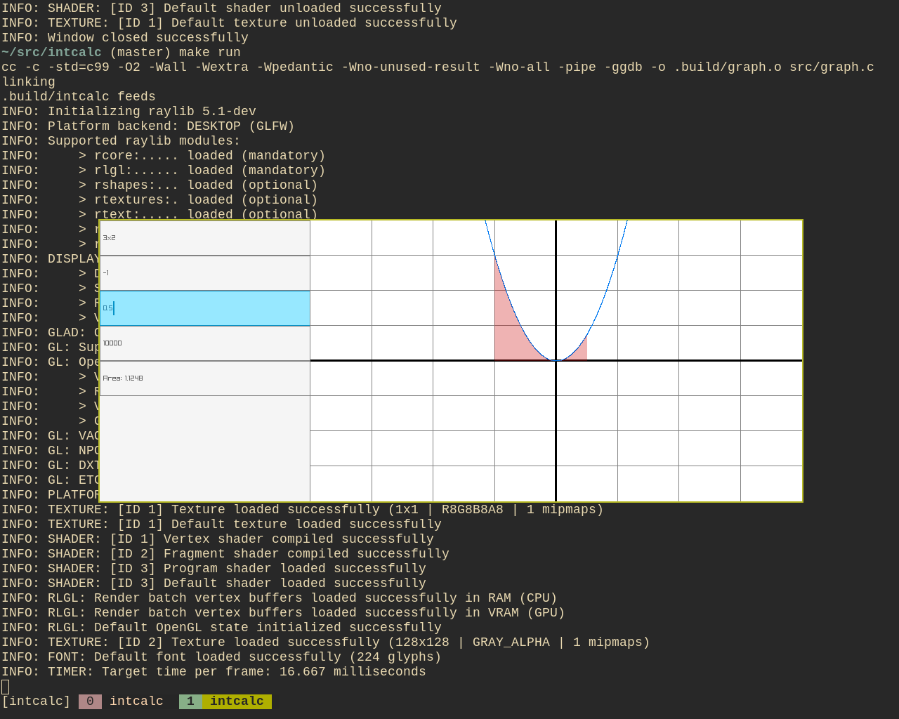

# intcalc
an integral calculator for simple polynomials made in c and raylib


## controls
first box is the function (see Syntax)
second is the lower bound of integration
third is the upper bound of integration
fourth is the amount of boxes to use in the reimann sum
fifth shows the area

## Syntax
the syntax is the same as it would be in desmos
$x^2$
```
x^2
```
$3x^2$
```
3x^2
```
$\sqrt{x}$
```
x^0.5
```
